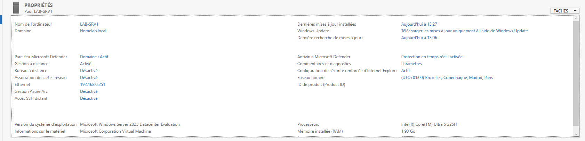
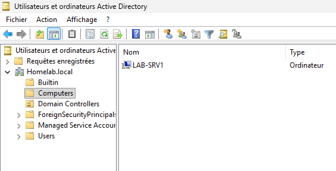
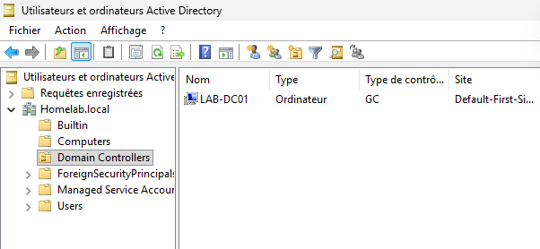

# Windows Server 2025 Lab — Joining a Member Server to the Domain



## 🎯 Objective

Deploy a second server, **LAB-SRV1**, running **Windows Server 2025** on Hyper-V, and join it to the existing `Homelab.local` domain hosted on `LAB-DC01`.

The objective of this lab is to practice:

* preparing a new Windows Server system as a domain member;
* configuring static networking pointing to the domain DNS server;
* joining a server to an Active Directory domain;
* understanding the difference between a local account and a domain account;
* verifying a computer object in Active Directory Users and Computers.

---

## 🏗️ Architecture

| Component  | Configuration                     |
| ---------- | ---------------------------------- |
| Hypervisor | Hyper-V on Windows 11              |
| Server     | `LAB-SRV1`                         |
| OS         | Windows Server 2025                |
| Role       | Domain member server               |
| Domain     | `Homelab.local`                    |
| NetBIOS    | `HOMELAB`                          |
| DC         | `LAB-DC01`                         |
| Network    | Internal vSwitch                   |

I temporarily used an **External vSwitch** to activate Windows and install server updates, then switched back to the **Internal vSwitch** used by the rest of the lab, so `LAB-SRV1` can reach `LAB-DC01`.

---

## 🖥️ Server Preparation

VM configuration:

* Generation 2;
* dynamically expanding VHDX disk;
* Windows Server 2025.

Steps performed before joining the domain:

* activated Windows and installed updates (External vSwitch);
* renamed the server to `LAB-SRV1`;
* configured a static IPv4 address;
* configured the preferred DNS server to point to `LAB-DC01`, since Active Directory relies on DNS to locate domain controllers.

--> Same principle as `LAB-DC01`: rename before joining, and never leave DNS pointing to a public resolver on a domain member — it needs to query the domain's own DNS server to find AD.

---

## 🔗 Joining the Domain

From **System Properties → Change → Domain**:

`Homelab.local`

To authorize the join, Windows prompts for credentials. This step must use the **domain Administrator account**, not the local Administrator account of `LAB-SRV1`:

```
HOMELAB\administrateur
```

--> Only a domain account has the rights to add a computer object to Active Directory. The local admin account of `LAB-SRV1` only exists in that machine's local SAM database and has no authority over the domain.

After confirmation, the server requests a restart to complete the join.

---

## 🔐 Logging On After the Join

On reboot, the logon screen behaves differently than expected.

Typing just `administrateur` is ambiguous: Windows tries to resolve it against known accounts **while you type**, and can silently guess wrong:

* incomplete input → defaults toward the domain context;
* input matching the local built-in account exactly → snaps to the **local** account instead.

This happens because there is no domain qualifier in the input, so Windows has to guess between a local account and a domain account.

--> The risk: logging on with the wrong account without realizing it, since the local admin and the domain admin can have different passwords.

**Fix: always qualify the account explicitly.** Any of these formats work and remove the ambiguity:

* `HOMELAB\administrateur` — NetBIOS\user
* `homelab.local\administrateur` — FQDN\user
* `administrateur@homelab.local` — UPN (User Principal Name, email-style)

---

## ✅ Verification

From `LAB-DC01`:

`Server Manager → Tools → Active Directory Users and Computers`

In the left pane, expanding `Homelab.local → Computers` shows the new `LAB-SRV1` object.



`LAB-DC01` itself does **not** appear there — it's listed separately under `Domain Controllers`.



**Why they're separated:**

* `Computers` is a **container**, not an Organizational Unit (OU) — Group Policy Objects cannot be linked to it directly;
* `Domain Controllers` is a real **OU**, with its own default GPO (`Default Domain Controllers Policy`) applying the specific security settings a DC requires.

--> In a real environment, newly joined computers are usually moved out of `Computers` into a dedicated OU (e.g. `Workstations` or `Servers`) right after the join, specifically so GPOs can be applied to them.

---

## 📌 Key Takeaways

This lab helped me understand that:

* joining a domain requires **domain administrator credentials**, not the local administrator account of the machine being joined;
* a server should have its **DNS pointing to the domain's DNS server** before attempting to join, otherwise it cannot locate the domain;
* Windows' logon screen tries to **guess** whether a typed username belongs to a local account or a domain account when no domain qualifier is given, and this guess can change while typing;
* to remove that ambiguity, the account must always be qualified using `NETBIOS\user`, `fqdn\user`, or `user@fqdn` — never just the bare username;
* the separator for domain-qualified logons is a backslash `\`, not a slash `/`;
* `Computers` is a container, not an OU, and cannot have GPOs linked to it directly;
* `Domain Controllers` is an OU with its own default GPO, which explains why domain controllers are never placed in `Computers`;
* verifying a domain join is as simple as checking for the new computer object in **Active Directory Users and Computers**.

---

## 📚 Sources

* Microsoft Learn — Active Directory Domain Services
* Microsoft Learn — Windows Server 2025
* *Windows Server 2025 Administration* course — Kevin Brown
