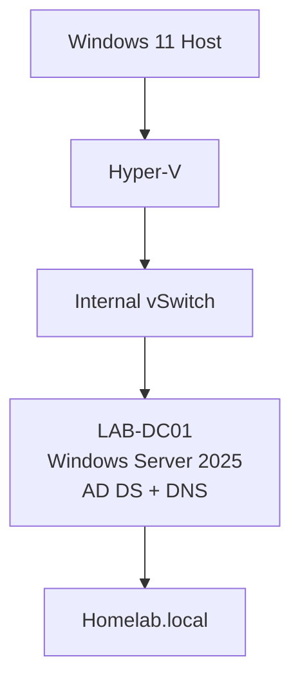

# Active Directory Homelab

## 📌 Overview

This repository documents my hands-on learning of Microsoft Active Directory and Windows Server 2025.

The objective of this project is to build an Active Directory environment from scratch using Hyper-V and progressively explore the main services and concepts used in enterprise Windows environments.

The lab will evolve as I learn new technologies and concepts.

---

## 🎯 Objectives

Through this project, I aim to gain practical experience with:

- Windows Server 2025 administration;
- Active Directory Domain Services (AD DS);
- Active Directory domains, trees, and forests;
- DNS integration with Active Directory;
- Organizational Units (OUs);
- users, groups, and computer accounts;
- Group Policy Objects (GPOs);
- Active Directory replication;
- multiple Domain Controllers;
- authentication and access management;
- Active Directory troubleshooting.

---

## 🏗️ Lab Environment

| Component | Configuration |
| --- | --- |
| Hypervisor | Hyper-V |
| Host OS | Windows 11 |
| Server OS | Windows Server 2025 |
| Domain | `Homelab.local` |
| First Domain Controller | `LAB-DC01` |
| Network | Hyper-V Internal vSwitch |

The lab is primarily isolated from my physical home network using an **Internal Hyper-V virtual switch**.

---

## 🗺️ Architecture

The environment will progressively evolve as additional servers, clients, and Active Directory services are added.

---

## 🧪 Labs

| Lab | Description | Status |
| --- | --- | --- |
| [Active Directory Domain Services](AD-DS/) | Deployment of the first Windows Server 2025 Domain Controller and creation of the `Homelab.local` forest and domain | ✅ Completed |
| More labs coming soon | This section will evolve as the homelab grows and new Active Directory topics are explored | 🚧 In progress |

---

## 🧠 Concepts Covered

Throughout this project, I will progressively study and practice:

- Forests, trees, and domains
- Organizational Units
- Domain Controllers
- Functional Levels
- Active Directory partitions
- Replication and replication boundaries
- DNS integration
- SYSVOL and NETLOGON
- Group Policy
- Authentication
- Redundancy

---

## 📚 Learning Resources

This project is based on hands-on practice alongside:

- Microsoft Learn documentation
- *Windows Server 2025 Administration* — Kevin Brown

---

## 📈 Project Status

🚧 **Work in progress**

This repository will be updated as I continue learning and expanding the Active Directory homelab.